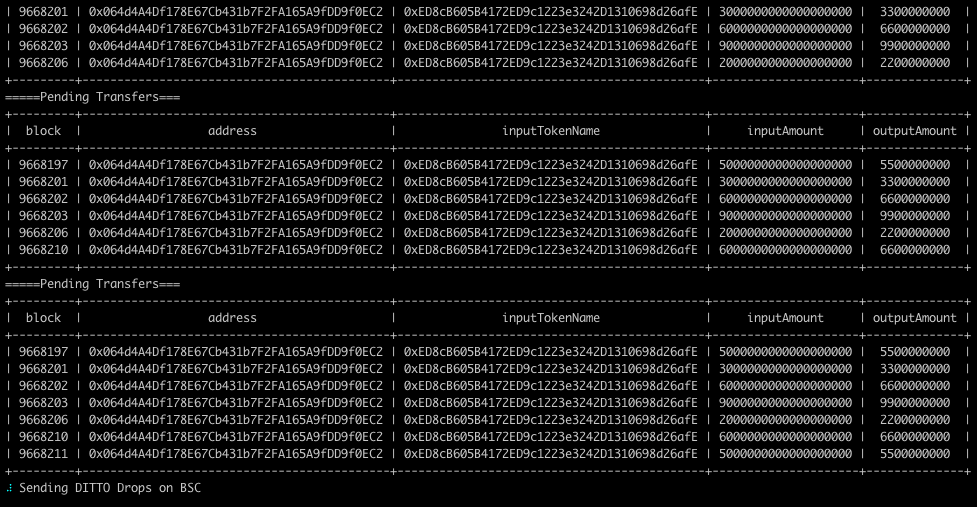
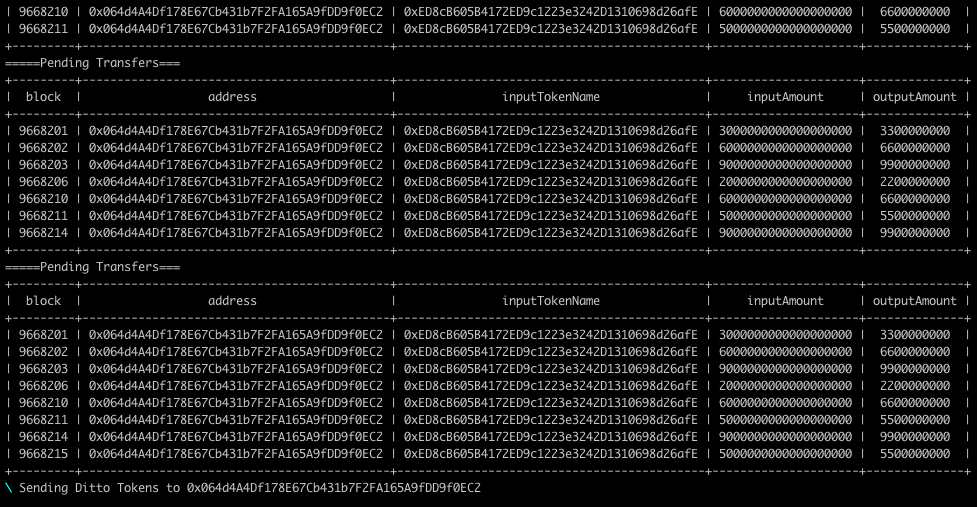

## Usage instructions

### Install required packages

```pip install -r requirements.txt```

### Update env variables

Copy ```sample.env``` to ```.env``` and input the missing values. ```ditto_erc20``` variable refers to the ditto erc20 on bsc.

### Using the script

Run ```python script.py```

On prompt choose between ```historical swaps``` and ```real time swaps```

```historical swaps``` prints all the swaps between given block numbers and write to a csv file.

```real time swaps``` listens for real time events, add swap events to a list and sends transactions on bsc after 15 confirmations on ethereum.

# Sample Output

### Export Historical Swaps Output


### Real Time Swaps Output




